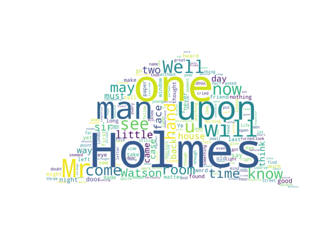

R Markdown Homework Assignment
================
Mojtaba Maleki (TILQ7Q)

First, let’s display some system information:

    ## "Machine type: AMD64

    ## Node name: DESKTOP-N4E76GE

    ## OS name: Windows

    ## OS release: 10

    ## OS version: 10.0.19044

    ## User name: student

    ## Home directory: C:\Users\student

    ## Current directory: C:\Users\student\Desktop\rmarkdown-assignment-MojtabaMaleki02-master

    ## PATH: C:\Users\student\.conda\envs\rmarkdown;C:\Users\student\.conda\envs\rmarkdown\Library\mingw-w64\bin;C:\Users\student\.conda\envs\rmarkdown\Library\usr\bin;C:\Users\student\.conda\envs\rmarkdown\Library\bin;C:\Users\student\.conda\envs\rmarkdown\Scripts;C:\Users\student\.conda\envs\rmarkdown\bin;C:\ProgramData\Miniconda3\condabin;C:\Program Files\Python39\Scripts;C:\Program Files\Python39;C:\Program Files (x86)\NVIDIA Corporation\PhysX\Common;C:\Program Files\Python310\Scripts;C:\Program Files\Python310;C:\Program Files\Common Files\Oracle\Java\javapath;C:\Program Files (x86)\Common Files\Oracle\Java\javapath;C:\Windows\system32;C:\Windows;C:\Windows\System32\Wbem;C:\Windows\System32\WindowsPowerShell\v1.0;C:\Windows\System32\OpenSSH;C:\Program Files\PuTTY;C:\Program Files\dotnet;C:\Program Files\nodejs;C:\ProgramData\chocolatey\bin;C:\Program Files\SASHome\SASFoundation\9.4\core\sasexe;C:\Program Files\SASHome\SASFoundation\9.4\ets\sasexe;C:\Program Files\SASHome\Secure\ccme4;C:\Program Files\SASHome\x86\Secure\ccme4;C:\Program Files (x86)\Windows Kits\8.1\Windows Performance Toolkit;C:\Program Files\Git\cmd;c:\Programok\apache-maven-3.8.4\bin;C:\Programok\Lingo;C:\Program Files\Pandoc;C:\Program Files\MATLAB\R2022a\runtime\win64;C:\Program Files\MATLAB\R2022a\bin;C:\Users\student\AppData\Local\Microsoft\WindowsApps;.

Let’s create a word cloud of the complete Sherlock Holmes Canon that is
available in plain text from
[here](https://sherlock-holm.es/stories/plain-text/cano.txt).

The word cloud can be generated with the
[word_cloud](https://github.com/amueller/word_cloud) package as follows:

``` python
from wordcloud import WordCloud, STOPWORDS
import urllib.request
from PIL import Image
import numpy as np

text = urllib.request.urlopen('https://sherlock-holm.es/stories/plain-text/cano.txt').read().decode('utf-8')

stopwords = set(STOPWORDS)
stopwords.add("said")

mask = np.array(Image.open('detectiveHat.png'))

wordcloud = WordCloud(stopwords=stopwords, collocations=False, mask=mask, margin=0, background_color='white').generate(text)

import matplotlib.pyplot as plt
plt.imshow(wordcloud, interpolation='bilinear')
plt.axis("off")
```

    ## (-0.5, 900.5, 485.5, -0.5)

``` python
plt.show()
```

<!-- -->

This document was generated on October 05, 2022 at 12:31:40.
